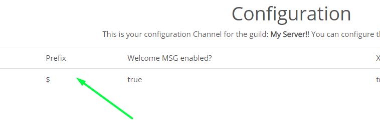

# Configuration Page

## What do all these things do??

Its relatively simple.

What you see:

## The Breakdown

## Server ID

That is your Server ID. It's your unique server ID. If you're going to submit a bug report, please put this ID into the report. 

## Prefix

That is your defined prefix. If you click on it you can change it from the dashboard. Or you can do it from discord by typing in the command `[PREFIX]set prefix !` to change it. 

## Greeter Module

This shows if the greeter module is enabled. If it is it will display `true` otherwise, it will display false.

## Experience Module

This is your experience module. You can enable or disable it. 

## Mod-log Channel 

This is your mod channel. Currently, you can only change it from discord by `[prefix]set mod-log` in the channel you want it to be in.

