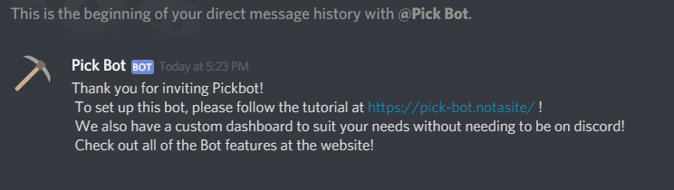
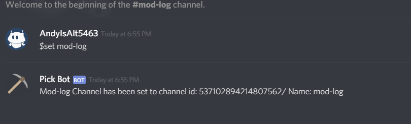
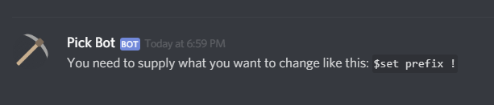

# README

## Quick Start

Setting up the bot is a fairly straight forward process:

## Initial Setup

Once you have invited the Bot to the server, the Bot should send a link to the owner like this.

Following the Link should lead you to the Pick Bot Dashboard where you can edit most of the features there. 

## Setup Mod-Log & Welcome Channel

Setting up the mod log channel and Welcome Channel is made easy with this Bot. 

All you have to do is type: `$set mod-log` into the channel you want the mod-log to be in and you're done!


You can also do this for the welcome Channel too. All you have to do is `$set welcomeChannel` into the welcome Channel.


And that's all! It should return a message 


If you get a message like this. It most likely means that you typed in the command wrong.



You can also change the prefix this way too! `$set prefix ! will set your prefix to !.`


You can also change the settings from the dashboard too!

1. 

2. 

3. 

4. 

5. 

You can go explore all the features the Dashboard has to offer here!

